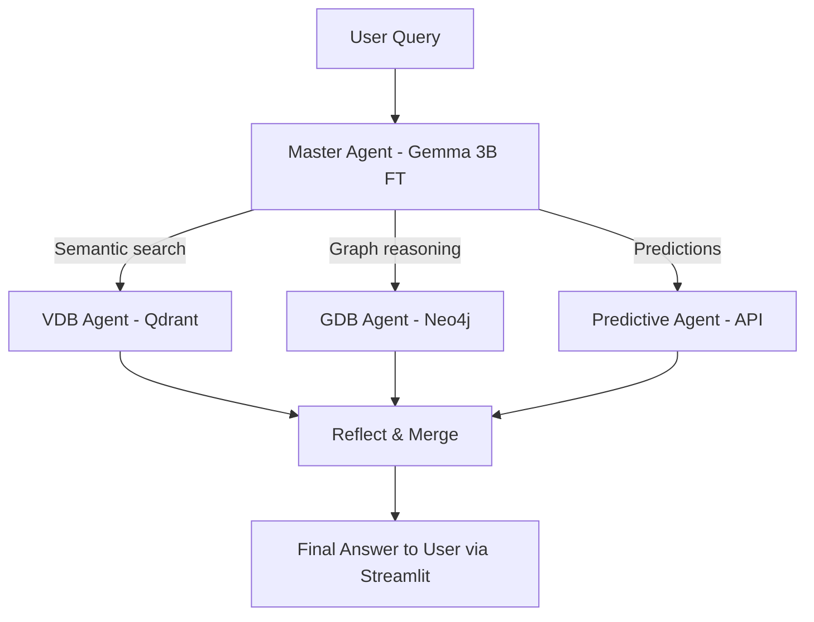

# Mining Safety Deep QA Agent

This repository contains the design and implementation plan for a **Deep QA Agent** focused on mining safety.  
It integrates **Qdrant (VDBs), Neo4j (GDB), predictive models (APIs), and a finetuned Gemma 3B LLM**, orchestrated through **LangChain**, with **Streamlit** as the frontend.

---

## 🎯 Objectives

- Build a **modular, hierarchical QA agent** for mining safety.  
- Integrate multiple knowledge sources:  
  - **Ontology, technical docs, synthetic/real data (VDBs in Qdrant)**.  
  - **Structured knowledge (Neo4j AuraDB)**.  
  - **Predictive insights (external APIs)**.  
- Enable **robust reasoning** with fallback and reflection.  
- Provide **explainable and reproducible** outputs.  
- Deliver an interactive **Streamlit-based QA interface**.  

---

## 🔹 Architecture Overview

The QA system follows a **hierarchical multi-agent architecture** inspired by `deepagents`:

- **Master Agent (Gemma 3B finetuned)**  
  Coordinates reasoning and decides which sub-agents to use.

- **Sub-Agents**  
  - **VDB Agent** → Semantic search with **Qdrant** (3 collections: ontology, technical docs, synthetic/real data).  
  - **GDB Agent** → Queries structured knowledge via **Neo4j AuraDB (Cypher)**.  
  - **Predictive Agent** → Calls external APIs for predictive models.  

---

## 🔹 Reasoning Loop

We extend beyond the classic **ReAct** with a **Plan → Execute → Reflect → Improve** cycle:

1. **Plan** → Decide which sub-agent(s) are required.  
2. **Execute** → Query tools (Qdrant, Neo4j, Predictive API).  
3. **Reflect** → Validate results, fallback if empty or inconsistent.  
4. **Improve** → Adjust tool usage dynamically for robustness.  

This ensures **resilient, self-correcting reasoning**.

---

## 🔹 Flow Diagram



---

## 🔹 Tools and Registry

Each tool/sub-agent is registered with clear schemas:

```yaml
name: gdb_query
description: "Query relationships in Neo4j AuraDB"
input_schema: { "query": "string" }
output_schema: { "nodes": "list", "relationships": "list" }
```

This ensures **consistency and interoperability**.

---

## 🔹 Embeddings and Vector Databases

- **Embedding model**: `BAAI/bge-m3`  
- **Vector store**: `Qdrant` with 3 collections:  
  - `ontology_vdb`  
  - `technical_docs_vdb`  
  - `synthetic_data_vdb` (expandable to real data).  

---

## 🔹 Graph Database

- **Neo4j AuraDB** for structured graph reasoning.  
- Entities include roles, tasks, risks, controls, incidents.  
- Queries written in **Cypher**.  

---

## 🔹 Predictive Models

- Exposed as **APIs** (FastAPI).  
- Input: structured operational data.  
- Output: incident probability, risk scores, etc.  
- Registered as `predictive_agent` tool.  

---

## 🔹 Unified Output Schema

All responses follow a unified JSON structure:

```json
{
  "answer": "Final enriched answer",
  "sources": ["ontology_vdb", "neo4j", "predictive_api"],
  "explanation": "Reasoning steps and fallback decisions",
  "metadata": {
    "retrieved_chunks": [],
    "cypher_queries": [],
    "prediction_scores": {}
  }
}
```

This guarantees **traceability and explainability**.

---

## 🔹 Evaluation and Benchmarking

We maintain a benchmark set of queries:

- **Ontology**: “What are the causes of fall-from-height incidents?”  
- **Graph**: “Which roles are connected to high-voltage tasks?”  
- **Predictive**: “What is the probability of an incident next week in Open Pit?”  

Evaluation includes:  
- Logging results.  
- Error analysis.  
- Accuracy and quality scoring.  

---

## 🔹 Repository Structure

```
/agents/        # Master + Sub-agents (VDB, GDB, Predictive)
/tools/         # Tool definitions with schemas
/tests/         # Benchmark queries + evaluation
/notebooks/     # Exploration and prototyping
/scripts/       # Reproducible pipelines (e.g., run_agent.py)
/frontend/      # Streamlit interface
```

---

## 🔹 Usage Example

Run the API backend:  
```bash
uvicorn scripts.run_agent:app --reload
```

Run the frontend:  
```bash
streamlit run frontend/app.py
```

---

## ✅ Best Practices

- Use **RouterQueryEngine** for lightweight routing before full agent orchestration.  
- Enable **explainability**: return retrieved chunks, Cypher queries, prediction scores.  
- Add **reflection/fallback logic** for failed tool calls.  
- Keep **tools modular** with JSON schemas.  
- Benchmark regularly with the `/tests/` module.  

---

## 🚀 Roadmap

- [ ] Implement modular sub-agents in LangChain.  
- [ ] Add reflection/fallback logic.  
- [ ] Standardize tool registry with JSON schemas.  
- [ ] Build reproducible pipelines (`run_agent.py`).  
- [ ] Develop evaluation module with benchmark queries.  
- [ ] Expand predictive APIs and connect real data.  
- [ ] Deploy first version of Streamlit frontend.  

---

## 🔹 Key Benefits

- **Hierarchical reasoning** → interpretable, modular design.  
- **Multi-source integration** → embeddings, graphs, predictions.  
- **Robustness** → reflection + fallback mechanisms.  
- **Explainability** → unified JSON schema for outputs.  
- **Reproducibility** → pipelines and tests.  
- **Scalability** → future-proof for real data and advanced models.  

---
