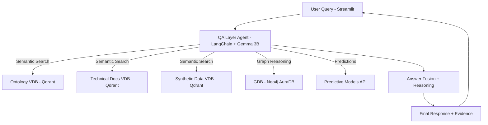

# QA Layer Agent – Mining Safety

This repository defines the architecture and strategy for a **Question Answering (QA) Agent** that integrates multiple information sources and predictive models for mining safety. The system leverages **LangChain**, **LlamaIndex**, **Neo4j AuraDB**, **Qdrant**, **Gemma 3B Finetuned**, and an initial frontend in **Streamlit**.

---

## 🚀 Objective
Design an agent capable of answering natural language questions in a **robust, explainable, and scalable** way, combining:
- Semantic retrieval from multiple **Vector Databases (VDBs)**.
- Structured queries in a **Graph Database (GDB)**.
- Inference from **predictive models** exposed via API.
- Reasoning and final answer generation using a **finetuned LLM (Gemma 3B)**.

---

## 🧩 Core Components

### 1. Central LLM
- **Gemma 3B finetuned** as the agent’s reasoning engine.
- Roles: tool selection, multi-source reasoning, and final response generation.

### 2. Vector Databases (VDBs)
- **Qdrant** as the vector store backend.
- Managed through **LlamaIndex** with `BAAI/bge-m3` embeddings.
- At least **3 collections**:
  - **Ontology VDB** – domain ontology (risks, causes, controls, etc.).
  - **Technical Docs VDB** – structured mining safety documents.
  - **Synthetic Data VDB** – generated incident/observation data (later real operational data).
- Query orchestration with **RouterQueryEngine**.

### 3. Graph Database (GDB)
- **Neo4j AuraDB**.
- Cypher queries via LangChain (`GraphCypherQAChain`) or `py2neo`.
- Used for structured relationships: roles → tasks → risks → controls → consequences.

### 4. Predictive Models
- Exposed as **REST APIs** (FastAPI).
- Input: operational features, risk indicators.
- Output: prediction score, probability, and explainability factors (e.g., SHAP values).
- Integrated as LangChain tools.

### 5. Frontend
- **Streamlit** as the MVP user interface.
- Communicates with backend through API endpoints.
- Designed to be replaceable by enterprise dashboards without changing backend logic.

---

## ⚙️ Orchestration Strategy

The agent follows a **multi-source orchestration pattern**:



### Execution Flow
1. **User query** enters via Streamlit.  
2. **Intent classification**: router (embedding-based or heuristic) determines relevant source(s).  
3. **Tool invocation**: LangChain agent calls VDB, GDB, predictive API, or a combination.  
4. **Result normalization**: all results converted into JSON with schema:
   ```json
   {
     "source": "Ontology VDB",
     "content": "...",
     "confidence": 0.89
   }
   ```
5. **Fusion & reasoning**: Gemma 3B integrates normalized results and generates the final response.  
6. **Explainability**: alongside the answer, the system outputs supporting evidence (chunks, Cypher queries, prediction logs).  

---

## 🔐 Robustness & Best Practices

1. **Router Layer**  
   - Lightweight intent classifier avoids overloading the LLM with trivial decisions.  

2. **Unified Result Schema**  
   - Multi-source outputs normalized into JSON for consistency.  

3. **Fallbacks**  
   - If a source is unavailable (e.g., Neo4j timeout), the agent responds with available context + disclaimer.  

4. **Logging & Traceability**  
   - Every query logs: tools invoked, response times, evidence returned.  

5. **Explainability First**  
   - Essential for mining safety: each answer includes the *why* and *how* behind it.  

6. **Sub-Agents Architecture**  
   - Specialized sub-agents (Graph agent, Predictive agent, VDB agent).  
   - A **master agent** coordinates calls.  

---

## 🛠️ Tech Stack

- **LLM**: Gemma 3B finetuned (via [Unsloth](https://github.com/unslothai/unsloth)).  
- **LangChain**: orchestration & multi-tool agent.  
- **LlamaIndex**: VDB management, RouterQueryEngine.  
- **Qdrant**: vector store (3 collections: ontology, docs, synthetic data).  
- **Neo4j AuraDB**: knowledge graph.  
- **FastAPI**: predictive model microservices.  
- **Streamlit**: initial UI.  
- **Embeddings**: `BAAI/bge-m3`.  

---

## 📌 Roadmap

- [x] Setup of 3 Qdrant VDBs (ontology, docs, synthetic data).  
- [x] Integrate Gemma 3B FT with LangChain.  
- [ ] Implement RouterQueryEngine with intent classifier.  
- [ ] Deploy predictive models as FastAPI services.  
- [ ] Normalize multi-source outputs into JSON schema.  
- [ ] Build explainability layer (retrieved chunks, Cypher, SHAP).  
- [ ] Migrate Streamlit MVP → enterprise-ready dashboard.  

---

## 📂 Suggested Repo Structure

```plaintext
├── README.md
├── agent/
│   ├── main_agent.py          # QA Layer Agent logic
│   ├── tools/
│   │   ├── vdb_tool.py        # Qdrant retrieval
│   │   ├── gdb_tool.py        # Neo4j connector
│   │   ├── predictive_tool.py # API wrapper
│   └── router.py              # Intent classifier
├── models_api/
│   └── app.py                 # FastAPI app for predictive models
├── notebooks/
│   └── exploration.ipynb
├── frontend/
│   └── streamlit_app.py
├── storage/
│   ├── qdrant/
│   ├── docstore.json
│   └── index_store.json
```

---

## 📖 Example Usage

```bash
# Start predictive model API
uvicorn models_api.app:app --reload

# Run the agent
python agent/main_agent.py

# Launch frontend
streamlit run frontend/streamlit_app.py
```

Example user queries:  
- “What are the critical controls active in the Concentrator Plant?”  
- “What is the probability of a fall-from-height incident this week?”  
- “Which historical trajectory led to similar near-miss events?”  

---

